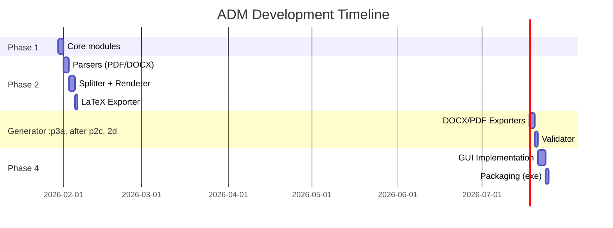

# 📋 Implementation Plan: Academic Document Manager (ADM) v1.0

> **Ngày**: 2026-01-29  
> **Phên bản**: 1.0 Full-featured  
> **Môi trường**: Desktop App (exe) + **GUI** + **CLI**, chạy trên IDE Antigravity

---

## 🎯 Mục tiêu

Xây dựng Desktop App Python với 2 chức năng chính cho xử lý văn bản học thuật (luận văn, báo cáo):

1. **Function 1**: PDF/DOCX → Markdown → LaTeX (Convert)
2. **Function 2**: AI Content Generation → Markdown → DOCX/PDF (Generate)
   - Tuân thủ quy trình **PDM (Project Document Manager)** từ video ItsDD
   - **Segmentation động** dựa trên số trang tài liệu
   - AI qua **IDE Antigravity** (không cần API key)
   - Python xử lý định dạng và xuất bản (đảm bảo 100% chuẩn format)

---

## 📌 Điểm thay đổi từ Brainstorm

| Điểm | Trước | Sau (User Feedback) |
|------|-------|---------------------|
| AI Integration | Claude/OpenAI API | Chạy trực tiếp trên IDE Antigravity |
| API Key | Cần | Không cần |
| Database | SQLite/JSON | Folder Segmentation với phases (MD/YAML) |
| GUI Language | TBD | Song ngữ Việt-Anh |
| Template | TBD | Tự thiết kế theo Nghị định 30/2020 |
| Scope | MVP | Full-featured |

---

## 📁 Cấu trúc thư mục dự án (TÁCH BIỆT 2 FUNCTIONS)

```
c:\du-an-trien-khai-skills-antigravity\
├── 📁 academic-document-manager/
│
│   ┌─────────────────────────────────────────────────────────────┐
│   │                    📂 SHARED MODULES                         │
│   └─────────────────────────────────────────────────────────────┘
│   │
│   ├── 📁 src/
│   │   ├── 📁 core/                   # Shared core
│   │   │   ├── config.py              # Configuration manager
│   │   │   └── utils.py               # Utility functions
│   │   │
│   │   ├── 📁 cli/                    # CLI entry points
│   │   │   ├── main.py                # adm (GUI launcher)
│   │   │   ├── convert.py             # adm-convert (Function 1)
│   │   │   └── generate.py            # adm-generate (Function 2)
│   │   │
│   │   ├── 📁 gui/                    # Desktop GUI (shared)
│   │   │   ├── main_window.py
│   │   │   ├── function1_view.py
│   │   │   ├── function2_view.py
│   │   │   └── settings_view.py
│   │   │
│   │   └── 📁 i18n/                   # Internationalization
│   │       ├── vi.yaml
│   │       └── en.yaml
│   │
│   ┌─────────────────────────────────────────────────────────────┐
│   │          🔵 FUNCTION 1: CONVERT (PDF/DOCX → LaTeX)          │
│   │                   (Không dùng templates Python)              │
│   └─────────────────────────────────────────────────────────────┘
│   │
│   ├── 📁 function1/
│   │   ├── 📁 input/                  # Drop files vào đây
│   │   │   └── (PDF/DOCX files)
│   │   │
│   │   ├── 📁 parsers/                # Parse input files
│   │   │   ├── pdf_parser.py          # PDF → IR
│   │   │   ├── docx_parser.py         # DOCX → IR
│   │   │   └── ir.py                  # Intermediate Representation
│   │   │
│   │   ├── 📁 processors/             # Process chunks
│   │   │   ├── splitter.py            # Split IR → Chunks
│   │   │   └── renderer.py            # Render chunks → output
│   │   │
│   │   ├── 📁 exporters/              # Export to formats
│   │   │   ├── latex_exporter.py      # Export to LaTeX
│   │   │   └── markdown_exporter.py   # Export to Markdown
│   │   │
│   │   ├── 📁 latex_templates/        # LaTeX templates (không phải Python)
│   │   │   ├── thesis/
│   │   │   │   ├── main.tex
│   │   │   │   └── styles.sty
│   │   │   └── report/
│   │   │       └── main.tex
│   │   │
│   │   └── 📁 output/                 # Output của Function 1
│   │       ├── chunks/
│   │       ├── markdown/
│   │       └── latex/
│   │
│   ┌─────────────────────────────────────────────────────────────┐
│   │        🟢 FUNCTION 2: GENERATE (AI → DOCX/PDF)              │
│   │              (Dùng Python templates - NĐ30/2020)             │
│   └─────────────────────────────────────────────────────────────┘
│   │
│   ├── 📁 function2/
│   │   ├── 📁 templates/              # ⭐ PYTHON TEMPLATES (CHỈ CHO F2)
│   │   │   ├── __init__.py
│   │   │   ├── 📁 styles/             # Base styles NĐ30/2020
│   │   │   │   ├── __init__.py
│   │   │   │   └── base_styles.py
│   │   │   ├── 📁 thesis/             # Luận văn
│   │   │   │   ├── __init__.py
│   │   │   │   └── thesis_template.py
│   │   │   ├── 📁 report/             # Báo cáo
│   │   │   │   ├── __init__.py
│   │   │   │   └── report_template.py
│   │   │   └── 📁 official/           # Công văn, Quyết định, Tờ trình
│   │   │       ├── __init__.py
│   │   │       └── official_templates.py
│   │   │
│   │   ├── 📁 rules/                  # ⭐ RULE BASES CHO AI
│   │   │   ├── __init__.py
│   │   │   ├── rule_bases.yaml        # 7 bộ rules
│   │   │   └── rule_loader.py
│   │   │
│   │   ├── 📁 generators/             # Generate sections & prompts
│   │   │   ├── section_generator.py
│   │   │   ├── prompt_builder.py
│   │   │   └── structures/
│   │   │       ├── thesis_structure.yaml
│   │   │       └── report_structure.yaml
│   │   │
│   │   ├── 📁 converters/             # Markdown → DOCX/PDF
│   │   │   ├── md_to_docx.py          # Apply templates Python
│   │   │   ├── md_to_pdf.py
│   │   │   └── docx_merger.py         # Merge sections thành 1 file
│   │   │
│   │   ├── 📁 validators/             # Validate format
│   │   │   └── nd30_validator.py      # Check chuẩn NĐ30/2020
│   │   │
│   │   └── 📁 Segmentation/           # Working directory (per project)
│   │       ├── project_info.yaml
│   │       ├── 📁 phase1_init/
│   │       ├── 📁 phase2_sections/
│   │       ├── 📁 phase3_content/
│   │       ├── 📁 phase4_rendered/
│   │       └── 📁 phase5_output/
│   │           ├── sections/
│   │           ├── MERGED_document.docx
│   │           └── MERGED_document.pdf
│   │
│   ┌─────────────────────────────────────────────────────────────┐
│   │                    📂 PROJECT FILES                          │
│   └─────────────────────────────────────────────────────────────┘
│   │
│   ├── 📁 docs/                       # Documentation
│   ├── 📁 tests/                      # Unit tests
│   ├── 📁 resources/                  # App resources
│   ├── 📄 main.py                     # Entry point
│   ├── 📄 requirements.txt
│   └── 📄 build.spec                  # PyInstaller config
│
└── 📁 Van Ban, Nghi Dinh ve INAN/     # Reference documents
```

---

### 🔍 So sánh 2 Functions

| Tiêu chí | Function 1 (Convert) | Function 2 (Generate) |
|----------|---------------------|----------------------|
| **Input** | PDF/DOCX file | Yêu cầu người dùng |
| **Output** | Markdown/LaTeX | DOCX/PDF chuẩn format |
| **Templates** | LaTeX templates (.tex) | **Python templates** |
| **AI** | Không dùng | Qua IDE Antigravity |
| **Format chuẩn** | N/A | NĐ30/2020 |
| **Folder** | `function1/` | `function2/` |
```

---

## 🔧 Proposed Changes

### Phase 1: Foundation (Core Modules)

#### [NEW] [config.py](file:///c:/du-an-trien-khai-skills-antigravity/academic-document-manager/src/core/config.py)
- Configuration manager cho app settings
- Load/save config từ YAML
- Quản lý paths, language settings

#### [NEW] [ir.py](file:///c:/du-an-trien-khai-skills-antigravity/academic-document-manager/src/core/ir.py)
- Định nghĩa Intermediate Representation (IR) dataclasses
- Block types: Heading, Paragraph, List, Table, Image, Code

#### [NEW] [pipeline.py](file:///c:/du-an-trien-khai-skills-antigravity/academic-document-manager/src/core/pipeline.py)
- Pipeline orchestrator cho 4 phases
- Quản lý workflow giữa các modules

#### [NEW] [commands.py](file:///c:/du-an-trien-khai-skills-antigravity/academic-document-manager/src/cli/commands.py)
- CLI commands sử dụng `argparse` hoặc `click`
- Tự động detect files trong `input/` folder

---

### ⚡ CLI Commands

> **Nguyên tắc**: Drop files vào `input/` → Chạy lệnh → Done!

---

#### 🔹 Function 1: `adm-convert` (PDF/DOCX → Markdown → LaTeX)

```bash
# Cách 1: Auto-detect files trong input/
adm-convert                          # Convert tất cả files
adm-convert --format latex           # Chỉ xuất LaTeX
adm-convert --format markdown        # Chỉ xuất Markdown
adm-convert --format all             # Xuất tất cả formats

# Cách 2: Chỉ định file cụ thể
adm-convert --file "path/to/file.docx"
adm-convert --file "path/to/file.pdf" --format latex

# Options
adm-convert --split-level 1          # Chia theo Heading 1
adm-convert --max-chars 6000         # Max chars per chunk
adm-convert --output "output/folder" # Thư mục output
```

---

#### 🔹 Function 2: `adm-generate` (AI Content → DOCX/PDF)

```bash
# Khởi tạo project mới
adm-generate init                    # Tạo cấu trúc dự án
adm-generate init --type thesis      # Luận văn
adm-generate init --type report      # Báo cáo
adm-generate init --pages 80         # Số trang dự kiến

# Tạo sections (chia nhỏ theo số trang)
adm-generate sections                # Tạo sections từ outline

# Export sau khi AI generate content (qua IDE Antigravity)
adm-generate export                  # Export từ phase3 → phase5
adm-generate export --format docx    # Chỉ xuất DOCX
adm-generate export --format pdf     # Chỉ xuất PDF
adm-generate export --format all     # Xuất tất cả

# Merge sections thành 1 file
adm-generate merge                   # Ghép tất cả sections
```

---

#### 🔹 Common Commands

```bash
# GUI mode
adm gui                              # Mở giao diện GUI

# Help
adm --help                           # Xem tất cả commands
adm-convert --help                   # Help cho convert
adm-generate --help                  # Help cho generate

# Version
adm --version
```

---

#### CLI Architecture

```
┌─────────────────────────────────────────────────────────────┐
│                      CLI Structure                           │
├─────────────────────────────────────────────────────────────┤
│                                                              │
│  📁 src/cli/                                                │
│  ├── __init__.py                                            │
│  ├── main.py           # Entry point (adm)                  │
│  ├── convert.py        # Function 1 (adm-convert)           │
│  └── generate.py       # Function 2 (adm-generate)          │
│                                                              │
│  📦 Entry Points (setup.py)                                 │
│  ├── adm           → src.cli.main:main                      │
│  ├── adm-convert   → src.cli.convert:main                   │
│  └── adm-generate  → src.cli.generate:main                  │
│                                                              │
└─────────────────────────────────────────────────────────────┘
```

#### CLI Flow Diagram

```
┌─────────────────────────────────────────────────────────────┐
│                      CLI Workflow                            │
├─────────────────────────────────────────────────────────────┤
│                                                              │
│  📁 input/                                                  │
│  ├── file1.docx                                             │
│  ├── file2.pdf    ──────┐                                   │
│  └── file3.docx         │                                   │
│                         ▼                                    │
│            ┌────────────────────────┐                       │
│            │  python main.py convert │                       │
│            │  (auto-detect files)    │                       │
│            └───────────┬────────────┘                       │
│                        │                                     │
│                        ▼                                     │
│  📁 Segmentation/                                           │
│  ├── phase1_init/                                           │
│  ├── phase2_sections/                                       │
│  ├── phase3_content/                                        │
│  ├── phase4_rendered/                                       │
│  └── phase5_output/                                         │
│      └── MERGED_document.docx  ← Final output               │
│                                                              │
└─────────────────────────────────────────────────────────────┘
```

---

### Phase 2: Function 1 - Convert (PDF/DOCX → Markdown → LaTeX)

#### [NEW] [pdf_parser.py](file:///c:/du-an-trien-khai-skills-antigravity/academic-document-manager/src/parsers/pdf_parser.py)
- Parse PDF using PyMuPDF (fitz)
- Extract text, images, tables → IR

#### [NEW] [docx_parser.py](file:///c:/du-an-trien-khai-skills-antigravity/academic-document-manager/src/parsers/docx_parser.py)
- Parse DOCX using python-docx
- Extract paragraphs, styles, images, tables → IR

#### [NEW] [splitter.py](file:///c:/du-an-trien-khai-skills-antigravity/academic-document-manager/src/processors/splitter.py)
- Split IR into chunks by heading level
- Configurable max_chars per chunk
- Save chunks to `phase2_chunks/`

#### [NEW] [renderer.py](file:///c:/du-an-trien-khai-skills-antigravity/academic-document-manager/src/processors/renderer.py)
- Render chunks to Markdown
- Render chunks to LaTeX
- Save to `phase3_rendered/`

#### [NEW] [latex_exporter.py](file:///c:/du-an-trien-khai-skills-antigravity/academic-document-manager/src/exporters/latex_exporter.py)
- Assemble LaTeX wrapper (main.tex)
- Include all parts
- Configure for LuaLaTeX/XeLaTeX

---

### 🔄 PDM Workflow cho Function 2 (Theo video ItsDD - 3 Bước)

> **Nguyên tắc cốt lõi:** AI tạo **nội dung Markdown** → Python xử lý **định dạng DOCX/PDF**

---

#### 📌 BƯỚC 1: KHỞI TẠO (Init)

**Input:** Yêu cầu khách hàng (từ file Word, Excel hoặc trao đổi trực tiếp)

**Output:**
- `PRD.md` - Product Requirements Document
- `project_info.yaml` - Cấu hình dự án
- `outline.md` - Đề cương chi tiết

```bash
adm-generate init --type thesis --pages 80 --title "Tên luận văn"
```

```yaml
# Segmentation/phase1_init/project_info.yaml
project_name: "Luận văn tốt nghiệp"
author: "Nguyễn Văn A"
total_pages: 80
document_type: "thesis"   # thesis | report | tech_docs | legal_docs
created_at: "2026-01-29"
```

**Tính toán Segmentation:**
| Số trang | Pages/Section | Số Sections |
|----------|---------------|-------------|
| 30-50    | 8             | 4-6         |
| 50-100   | 10            | 5-10        |
| 100-200  | 12            | 9-17        |
| 200+     | 15            | 14+         |

---

#### 📌 BƯỚC 2: GENERATE NỘI DUNG THÔ (Markdown)

**Input:** Outline từ Bước 1 + Rule bases

**Process:** AI (qua IDE Antigravity) generate từng section

**Output:** Các file `section_XXX.md` chứa nội dung Markdown thuần

```bash
adm-generate sections    # Tạo sections từ outline
# Sau đó dùng IDE Antigravity để generate content cho từng section
```

**Tại sao dùng Markdown?**
- AI thường không ổn định về format Word (lúc này lúc khác)
- Markdown giúp kiểm soát **nội dung thuần túy** trước
- Dễ validate, dễ chỉnh sửa

**Cấu trúc section prompt:**
```markdown
# Section 1: Tổng quan

## Mục tiêu
- Giới thiệu vấn đề nghiên cứu
- Nêu bối cảnh và tính cấp thiết

## Outline
1.1. Đặt vấn đề
1.2. Mục tiêu nghiên cứu
1.3. Phạm vi nghiên cứu

## Rules (từ rule_bases.yaml)
- Giọng văn học thuật, khách quan
- Mỗi đoạn 100-200 từ
- Có trích dẫn nếu cần

## Output expected
~1500-2000 từ, Markdown thuần
```

---

#### 📌 BƯỚC 3: CHUYỂN ĐỔI BẰNG PYTHON (Local)

**Input:** Các file Markdown từ Bước 2

**Process:** Python đọc Markdown → Apply templates → Export

**Output:** File DOCX/PDF chuẩn format

```bash
adm-generate export --format all    # Export DOCX + PDF
adm-generate merge                  # Ghép sections thành 1 file
```

**Lợi ích:**
- ✅ Tiết kiệm năng lượng AI (không cần AI format)
- ✅ Chạy trực tiếp trên máy local
- ✅ **100 file xuất ra đều có format giống hệt nhau**
- ✅ Đạt chuẩn in ấn và pháp lý (NĐ30/2020)

**Templates sử dụng:**
- `ThesisTemplate` - Luận văn
- `ReportTemplate` - Báo cáo
- `CongVanTemplate` - Công văn
- `QuyetDinhTemplate` - Quyết định
- `ToTrinhTemplate` - Tờ trình

---

#### 📁 Cấu trúc Segmentation Folder

```
Segmentation/
├── phase1_init/               # Bước 1: Khởi tạo
│   ├── project_info.yaml
│   ├── PRD.md
│   └── outline.md
│
├── phase2_sections/           # Bước 2: Sections + Prompts
│   ├── section_001.md         # Outline + Prompt cho section 1
│   ├── section_002.md
│   └── prompts.yaml           # Lưu prompts đã dùng
│
├── phase3_content/            # Bước 2: Output từ AI
│   ├── content_001.md         # Nội dung Markdown từ AI
│   ├── content_002.md
│   └── ...
│
├── phase4_rendered/           # Bước 3: Rendered DOCX
│   ├── section_001.docx
│   ├── section_002.docx
│   └── ...
│
└── phase5_output/             # Bước 3: Final output
    ├── sections/              # Từng file riêng
    │   └── ...
    ├── MERGED_document.docx   # File ghép hoàn chỉnh
    ├── MERGED_document.pdf
    └── validation_report.md   # Báo cáo kiểm tra format
```

---

#### 🚀 "Zolo Mode" - Chạy tự động từ A-Z

```bash
adm-generate zolo --type thesis --pages 80
# → Tự động: Init → Generate prompts → (AI) → Export → Merge
# → Output: Bộ tài liệu hoàn chỉnh trong vài chục giây
```

---

### Phase 3: Function 2 - Generate (Content → DOCX/PDF)

#### [NEW] [section_generator.py](file:///c:/du-an-trien-khai-skills-antigravity/academic-document-manager/src/generators/section_generator.py)
- Generate content structure from templates
- Create Markdown sections với prompts cho AI
- Save to Segmentation folder

#### [NEW] [thesis_structure.yaml](file:///c:/du-an-trien-khai-skills-antigravity/academic-document-manager/src/generators/templates/thesis_structure.yaml)
- Template cấu trúc luận văn chuẩn
- Sections: Mở đầu, Chương 1-N, Kết luận, Tài liệu tham khảo

#### [NEW] [docx_exporter.py](file:///c:/du-an-trien-khai-skills-antigravity/academic-document-manager/src/exporters/docx_exporter.py)
- Export Markdown → DOCX
- Apply styles theo Nghị định 30/2020
- Font: Times New Roman, margins theo chuẩn

#### [NEW] [docx_merger.py](file:///c:/du-an-trien-khai-skills-antigravity/academic-document-manager/src/exporters/docx_merger.py)
- **Merge tất cả file DOCX sections thành 1 file duy nhất**
- Giữ nguyên styles, headers, footers
- Tự động đánh số trang liên tục
- Tạo Table of Contents tự động

#### [NEW] [pdf_exporter.py](file:///c:/du-an-trien-khai-skills-antigravity/academic-document-manager/src/exporters/pdf_exporter.py)
- Export to PDF via:
  - WeasyPrint (from HTML)
  - hoặc pdflatex (from LaTeX)

#### [NEW] [validator.py](file:///c:/du-an-trien-khai-skills-antigravity/academic-document-manager/src/processors/validator.py)
- Validate document against Nghị định 30/2020
- Check: fonts, margins, headings format
- Generate validation report

---

### Phase 4: GUI + Packaging

#### [NEW] [main_window.py](file:///c:/du-an-trien-khai-skills-antigravity/academic-document-manager/src/gui/main_window.py)
- Main application window
- Tab navigation: Function 1 | Function 2 | Settings
- Language switcher (VI/EN)

#### [NEW] [function1_view.py](file:///c:/du-an-trien-khai-skills-antigravity/academic-document-manager/src/gui/function1_view.py)
- File picker for input (PDF/DOCX)
- Output format selector (Markdown/LaTeX/All)
- Progress indicator
- Preview panel

#### [NEW] [function2_view.py](file:///c:/du-an-trien-khai-skills-antigravity/academic-document-manager/src/gui/function2_view.py)
- Template selector (Thesis/Report)
- Section editor
- Output format selector
- Export buttons

#### [NEW] [main.py](file:///c:/du-an-trien-khai-skills-antigravity/academic-document-manager/main.py)
- Application entry point
- Initialize GUI and config

#### [NEW] [build.spec](file:///c:/du-an-trien-khai-skills-antigravity/academic-document-manager/build.spec)
- PyInstaller configuration
- Bundle as single exe

---

## 📊 Implementation Order



---

## ✅ Verification Plan

### Automated Tests

```bash
# Chạy unit tests
cd c:\du-an-trien-khai-skills-antigravity\academic-document-manager
python -m pytest tests/ -v

# Test specific module
python -m pytest tests/test_parsers.py -v
python -m pytest tests/test_processors.py -v
python -m pytest tests/test_exporters.py -v
```

### Manual Verification

#### Test Function 1 (Convert)
1. Mở app, chọn tab "Convert"
2. Chọn file DOCX mẫu từ folder test
3. Chọn output format: LaTeX
4. Click "Convert"
5. Kiểm tra folder `Segmentation/` có đủ 4 phases
6. Mở file `phase4_output/main.tex` trong Overleaf/LaTeX editor
7. Compile bằng LuaLaTeX, verify không có lỗi

#### Test Function 2 (Generate)
1. Mở app, chọn tab "Generate"
2. Chọn template "Thesis"
3. Nhập tên các chương
4. Click "Generate Structure"
5. Kiểm tra folder `Segmentation/` có các file markdown
6. Export to DOCX
7. Mở file trong Microsoft Word, verify format đúng chuẩn NĐ30

#### Test GUI
1. Khởi động app bằng `python main.py`
2. Verify app hiển thị đúng
3. Chuyển ngôn ngữ VI/EN, verify text thay đổi
4. Test các buttons, file pickers hoạt động

#### Test Executable
1. Build exe: `pyinstaller build.spec`
2. Chạy file exe từ folder `dist/`
3. Verify app hoạt động như chạy từ Python

---

## 📦 Dependencies

```txt
# requirements.txt
python-docx>=1.1.0
PyMuPDF>=1.23.0
customtkinter>=5.2.0
Jinja2>=3.1.0
PyYAML>=6.0
mistune>=3.0.0
weasyprint>=60.0
Pillow>=10.0.0
pyinstaller>=6.0.0
pytest>=7.4.0
```

---

## ⚠️ User Review Required

> [!IMPORTANT]
> Xin xác nhận các điểm sau trước khi bắt đầu coding:

1. **Cấu trúc thư mục** có phù hợp không?
2. **Thứ tự implementation** (Phase 1 → 4) có ổn không?
3. **Dependencies** có thiếu gì không?
4. **Verification plan** có cần bổ sung gì không?
