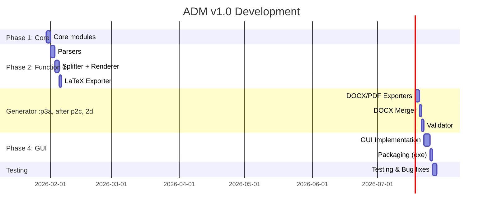

# 📄 PRD: Academic Document Manager (ADM) v1.0

> **Ngày tạo**: 2026-01-29  
> **Phiên bản**: 1.0  
> **Trạng thái**: Draft  
> **Tác giả**: AI Assistant + User

---

## 1. Overview

**Academic Document Manager (ADM)** là Desktop App Python với GUI + CLI, hỗ trợ xử lý văn bản học thuật:

| Function | Mô tả | Templates |
|----------|-------|----------|
| **Function 1 - Convert** | PDF/DOCX → Markdown → LaTeX | LaTeX (.tex) |
| **Function 2 - Generate** | AI Content → Markdown → DOCX/PDF | **Python templates** |

**Target Users**: Sinh viên, nghiên cứu sinh, giảng viên.

### Kiến trúc tách biệt
```
academic-document-manager/
├── src/              # Shared (core, cli, gui)
├── function1/        # 🔵 CONVERT - LaTeX templates
└── function2/        # 🟢 GENERATE - Python templates (NĐ30/2020)
```

---

## 2. Problem Statement

### 2.1 Vấn đề hiện tại

| # | Vấn đề | Hậu quả |
|---|--------|---------|
| P1 | Chuyển đổi Word → LaTeX thủ công tốn nhiều thời gian | Mất hàng giờ/ngày chỉ để format |
| P2 | Tài liệu dài (100+ trang) khó xử lý bằng AI | AI bị "gãy" ngữ cảnh, output không nhất quán |
| P3 | AI xuất file Word/PDF trực tiếp bị lỗi định dạng | Không đạt chuẩn in ấn, phải chỉnh sửa lại |
| P4 | Không có công cụ validate format theo Nghị định 30/2020 | Văn bản không đạt chuẩn hành chính |
| P5 | Phải dùng nhiều tool khác nhau cho workflow | Workflow phức tạp, dễ sai sót |

### 2.2 User Pain Points

> *"Tôi mất cả tuần để format luận văn 80 trang từ Word sang LaTeX"*

> *"AI generate nội dung tốt nhưng khi xuất file thì format lung tung"*

> *"Mỗi lần sửa file phải copy-paste qua nhiều tool khác nhau"*

---

## 3. Solution & Features

### 3.1 Giải pháp tổng thể

**Nguyên tắc cốt lõi** (theo video PDM của ItsDD):
- AI tạo **nội dung (Markdown)** → Python xử lý **định dạng (DOCX/PDF)**
- **Segmentation động** theo số trang để tránh tràn context
- **100% chuẩn format** nhờ Python render

### 3.2 Feature List

#### Function 1: Convert (PDF/DOCX → Markdown → LaTeX)

| ID | Feature | Mô tả | Priority |
|----|---------|-------|----------|
| F1.1 | PDF Parser | Extract text, images, tables từ PDF | High |
| F1.2 | DOCX Parser | Extract paragraphs, styles từ DOCX | High |
| F1.3 | Splitter | Chia nhỏ theo heading/max_chars | High |
| F1.4 | LaTeX Renderer | Convert chunks → .tex files | High |
| F1.5 | LaTeX Assembler | Tạo main.tex wrapper | High |
| F1.6 | Image Extractor | Extract và lưu hình ảnh | Medium |
| F1.7 | Table Converter | Convert bảng → LaTeX tabular | Medium |

#### Function 2: Generate (AI Content → DOCX/PDF)

| ID | Feature | Mô tả | Priority |
|----|---------|-------|----------|
| F2.1 | PDM Init | Khởi tạo project với thông tin cơ bản | High |
| F2.2 | Dynamic Segmentation | Tính toán sections theo số trang | High |
| F2.3 | Section Generator | Tạo outline + prompts cho từng section | High |
| F2.4 | DOCX Exporter | Markdown → DOCX với styles NĐ30 | High |
| F2.5 | **DOCX Merger** | **Ghép tất cả sections → 1 file duy nhất** | High |
| F2.6 | PDF Exporter | Export sang PDF | High |
| F2.7 | Format Validator | Validate theo Nghị định 30/2020 | Medium |
| F2.8 | TOC Generator | Tạo Table of Contents tự động | Medium |

#### GUI & CLI

| ID | Feature | Mô tả | Priority |
|----|---------|-------|----------|
| G1 | Main Window | Tab navigation: Function 1/2/Settings | High |
| G2 | File Picker | Chọn file input/output | High |
| G3 | Progress Bar | Hiển thị tiến độ xử lý | Medium |
| G4 | Language Switcher | Song ngữ Việt-Anh | Medium |
| G5 | Build EXE | Đóng gói thành file .exe | High |
| **C1** | **adm-convert** | **CLI cho Function 1** | High |
| **C2** | **adm-generate** | **CLI cho Function 2** | High |

### 3.3 Python Modules (Function 2)

| Module | File | Mô tả |
|--------|------|-------|
| Templates | `base_styles.py` | Styles chuẩn NĐ30/2020 |
| Templates | `thesis_template.py` | Template luận văn |
| Templates | `report_template.py` | Template báo cáo |
| Templates | `official_templates.py` | Công văn, Quyết định, Tờ trình |
| Converters | `md_to_docx.py` | Markdown → DOCX |
| Converters | `docx_merger.py` | Merge DOCX → 1 file |
| Rules | `rule_bases.yaml` | 7 bộ rules cho AI |

---

## 4. User Stories

### Function 1 - Convert

| ID | As a... | I want to... | So that... |
|----|---------|--------------|------------|
| US1.1 | Sinh viên | Convert file DOCX luận văn sang LaTeX | Tôi có thể format chuyên nghiệp cho in ấn |
| US1.2 | Nghiên cứu sinh | Chia nhỏ file PDF 200 trang thành chunks | AI có thể xử lý từng phần không bị gãy context |
| US1.3 | Giảng viên | Extract hình ảnh và bảng từ Word | Tôi có thể tái sử dụng trong LaTeX |

### Function 2 - Generate

| ID | As a... | I want to... | So that... |
|----|---------|--------------|------------|
| US2.1 | Sinh viên | Tạo cấu trúc luận văn chuẩn | Tôi có đề cương chi tiết để bắt đầu viết |
| US2.2 | Nghiên cứu sinh | Generate nội dung từng section bằng AI | Tôi có bản draft để chỉnh sửa |
| US2.3 | Người viết báo cáo | Ghép các sections thành 1 file Word hoàn chỉnh | Tôi có file cuối cùng để nộp |
| US2.4 | Giảng viên | Validate format theo Nghị định 30/2020 | Văn bản đạt chuẩn hành chính |

---

## 5. Success Metrics

| Metric | Target | Cách đo |
|--------|--------|---------|
| **Conversion Accuracy** | ≥95% nội dung được chuyển đổi chính xác | Test với 10 file mẫu |
| **Time Saved** | Giảm 80% thời gian so với thủ công | So sánh A/B với workflow cũ |
| **Format Compliance** | 100% đạt chuẩn NĐ30/2020 | Validator check pass |
| **User Satisfaction** | ≥4.5/5 stars | Survey sau 1 tuần sử dụng |
| **Merge Success Rate** | 100% files được ghép thành công | Test với 20 projects |

---

## 6. Out of Scope (v1.0)

Các tính năng sau **KHÔNG** nằm trong phạm vi v1.0:

| # | Feature | Lý do | Xem xét cho |
|---|---------|-------|-------------|
| 1 | Cloud sync | Phức tạp, cần backend | v2.0 |
| 2 | Real-time collaboration | Cần nhiều infrastructure | v2.0 |
| 3 | Mobile app | Desktop-first approach | v3.0 |
| 4 | External API integration | Chạy trên IDE Antigravity | N/A |
| 5 | Database server | Dùng folder/file structure | N/A |
| 6 | Custom template builder | Cung cấp templates có sẵn | v2.0 |
| 7 | Citation manager (như Zotero) | Có tools chuyên dụng | v2.0 |

---

## 7. Technical Considerations

### 7.1 Tech Stack

| Component | Technology | Lý do |
|-----------|------------|-------|
| Language | Python 3.10+ | Cross-platform, rich libraries |
| GUI | CustomTkinter | Modern UI, dễ học |
| PDF Parser | PyMuPDF | Nhanh, full-featured |
| DOCX | python-docx | Mature, reliable |
| Markdown | mistune | Fast, extensible |
| Packaging | PyInstaller | Single exe cho Windows |

### 7.2 Constraints

- **Platform**: Windows (primary), macOS/Linux (secondary)
- **File size**: Hỗ trợ files ≤500MB
- **Concurrent files**: Xử lý 1 file tại 1 thời điểm
- **Language**: Tiếng Việt (primary), English (secondary)

### 7.3 Dependencies

```
python-docx>=1.1.0
PyMuPDF>=1.23.0
customtkinter>=5.2.0
Jinja2>=3.1.0
PyYAML>=6.0
mistune>=3.0.0
Pillow>=10.0.0
pyinstaller>=6.0.0
click>=8.1.0              # CLI framework
```

### 7.4 CLI Commands

```bash
# Function 1
adm-convert                    # Auto-detect input/
adm-convert --format latex

# Function 2
adm-generate init --type thesis --pages 80
adm-generate sections
adm-generate export --format all
adm-generate merge

# GUI
adm gui
```

### 7.5 Function 2 - 3 Bước Workflow

| Bước | Mô tả | Output |
|------|-------|--------|
| 1. Init | Nhận yêu cầu → PRD + Config | `PRD.md`, `project_info.yaml` |
| 2. Generate | AI (Antigravity) tạo Markdown | `content_XXX.md` |
| 3. Convert | Python → DOCX/PDF chuẩn | `MERGED_document.docx` |

---

## 8. Timeline



**Estimated Total**: ~18 working days

---

## 9. RICE Prioritization

| Feature | Reach | Impact | Confidence | Effort | Score |
|---------|-------|--------|------------|--------|-------|
| F2.5 DOCX Merger | 10 | 3 | 90% | 2 | **13.5** |
| F1.1 PDF Parser | 8 | 3 | 85% | 3 | **6.8** |
| F1.2 DOCX Parser | 10 | 3 | 90% | 2 | **13.5** |
| F2.2 Dynamic Segmentation | 8 | 3 | 80% | 2 | **9.6** |
| F2.4 DOCX Exporter | 10 | 3 | 85% | 3 | **8.5** |
| G5 Build EXE | 10 | 2 | 95% | 1 | **19.0** |

> **Ghi chú**: Score = (Reach × Impact × Confidence) / Effort

### Priority Order:
1. 🥇 G5: Build EXE (19.0)
2. 🥈 F2.5: DOCX Merger (13.5)
3. 🥈 F1.2: DOCX Parser (13.5)
4. 🥉 F2.2: Dynamic Segmentation (9.6)
5. F2.4: DOCX Exporter (8.5)
6. F1.1: PDF Parser (6.8)

---

## 10. Appendix

### A. Nghị định 30/2020/NĐ-CP Standards

| Thành phần | Quy định |
|------------|----------|
| Khổ giấy | A4 (210mm × 297mm) |
| Lề trên/dưới | 20-25mm |
| Lề trái | 30-35mm |
| Lề phải | 15-20mm |
| Font | Times New Roman |
| Cỡ chữ nội dung | 13-14pt |
| Cỡ chữ tiêu đề | 13-14pt, đậm |

### B. Related Documents

- [Brainstorm ADM](file:///C:/Users/DONG/.gemini/antigravity/brain/58886692-b96c-4bf3-9091-0c0ebab1a010/brainstorm_adm.md)
- [Implementation Plan](file:///C:/Users/DONG/.gemini/antigravity/brain/58886692-b96c-4bf3-9091-0c0ebab1a010/implementation_plan.md)
